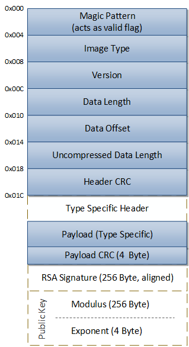

# Image format

An ias_image file consists of:

1. Generic Header
2. Type Specific Header (depends on the image type)
3. Payload
4. Payload CRC
5. RSA Signature (optional)
6. Public Key: Modulus and Exponent (optional)

*Blocks made of dash lines are optional.

## Generic Header

### ias_image Header Coding

| Field         | Byte offset | Byte length | Description                         |
|---------------|------------:|------------:|-------------------------------------|
| Magic Pattern |      0      |      4      | This field identifies the structure |
| Image Type    |      4      |      4      | The image type (Bit field) |
| Version       |      8      |      4      | Version number of the data inside the image |
| Data Length   |     12      |      4      | The size of payload (data) in image |
| Data Offset   |     16      |      4      | The offset to payload data from header |
| Uncompressed Data Length  |     20      |      4      | Uncompressed data length |
| Header CRC    |     24      |      4      | CRC-32C over entire header |

Format: 7 x 32 Bit unsigned int

### Magic Pattern

Value to identify at the beginning of an image.

> MAGIC_PATTERN = 0x2E6B7069;  /* ".kpi" */

> Format: 32 Bit unsigned int

Optional: Could be used as a valid flag for update process.

### Image Type

The content of an iasImage is described by the image type field at offset 0x4 in the generic header. It consists of five sub-fields that are laid out as follows:

| Field       | Bit range | Description                                                              |
| ----------- | --------: | ------------------------------------------------------------------------ |
| Reserved    |   0:7     | These bits are reserved for future use                                   |
| Signed      |     8     | Set if the image is signed (that is, the RSA signature field is present) |
| HaveKey     |     9     | Set if the public key (modulus plus exponent) is present                 |
| Version     | 10:15     | Reserved                                                                 |
| ImageType   | 16:31     | The tag that identifies the image type                                   |

> Format: 32 Bit unsigned int

The supported Image types are listed in the next chapter.

### Version

Version number of the data inside the image which is used for the update process.

> Format: 32 Bit unsigned int

### Data Length

Data Length only specifies the length of the data inside the image excluding the type specific header.

> Format: 32 Bit unsigned int

### Data Offset

Offset where the data starts inside the image.

> Format: 32 Bit unsigned int

### Uncompressed Data Length

Specifies the uncompressed data length if there is an compressed data inside the image.
Otherwise it is the same as Data Length.

> Format: 32 Bit unsigned int

### Header CRC

CRC32 checksum of the generic header.

> Format: 32 Bit unsigned int

## Type Specific Header

Additional information belonging to a specific type of data.
On a single-file image these fields are optional and could be added by cmdline parameter [-t].
For a multi-file image the type-specific header by default contains the size of the input files.

> Format: n x 32 Bit unsigned int

Structure:

Normal image:

    uint32_t -  argument 1
    uint32_t -  argument 2
    ...

Multi-file image:

    uint32_t -  size for file 1
    uint32_t -  size for file 2
    ...

## Image Payload

The data normally consists of one file but it can be extended to multiple files depending on the user needs.
When multiple files are used they are aligned to 4 bytes (from the image starting point). Optionally files can be page aligned.

## Payload CRC

At the end a data-CRC32 checksum is added. This is calculated over the type-specific header and the payload data.

CRC32 checksum of the payload.

> Format: 4 Byte unsigned int

## RSA Signature

RSA signature (optional) of the above content will be appended at the end of the image which might be later on acquired by a bootloader if it is in a secure mode. When bootloader is not in a secure mode than RSA signature is not required at all.

It is aligned to a 256 Byte boundary by adding padding bytes.

A verification of the signature could only be done by providing the public key.

> Format: 256 Byte

> Note: It is 256 Byte aligned.

## Public Key
Public Key which is optional is added at the very end of each ias Image and contains Modulus and Exponent files:

### Modulus
> Format: 256 Byte unsigned int

### Exponent

> Format: 4 Byte unsigned int

