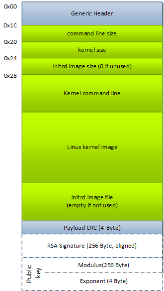
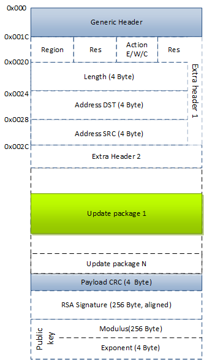

# Image types

## List of supported image types

| ID value | Description                                                      |
| -------: | ---------------------------------------------------------------- |
|    0     | unspecified (unknown)                                            |
|    1     | Linux kernel command line - deprecated                           |
|    2     | Linux kernel image (bzImage) - deprecated                        |
|    3     | Multi-file boot image                                            |
|    4     | Stand-alone ELF multi-boot image                                 |
|    5     | Update package file                                              |
|    6     | ABL Configuration image                                          |
|    7     | Internal - calibration results stored by ABL                     |
|    8     | IFWI update package                                              |
|    9     | PDR update package                                               |
|    10    | Firmware package                                                 |
|    11    | Pre-OS checker image                                             |

## 1. Linux command line

> Type: single-file

> File: cmdline.txt

deprecated

## 2. Linux kernel image (bzImage)

> Type: multi-file

> File: bzImage

deprecated

## 3. Multi-file boot image

> Type: multi-file

> Files: cmdline.txt, bzImage, initrd, acpi.bin, firmware1.bin, firmware2.bin, ...

The boot image (#3) combines at least a kernel command line and the Linux kernel image (bzImage).
Optional a initial RAM disk a ACPI binary (tables) and a list of firmware could be appended.
The input files are in fixed order. If some in between are not in use, they have to be added as empty files.
Optionally files can be page aligned from a given file, by adding dummy file before given file (page alignment parameter) with padded data (zeros) to align image to 4KiB.

*Blocks made of dash lines are optional.

## 4. Stand-alone ELF multi-boot image

> Type: multi-file

> Files: cmdline1.txt, elf1.bin, cmdline2.txt, elf2.bin, ...

Optionally odd files (cmdlineX.txt) can be padded with zeros before given file (page alignment parameter) to have next file (elf) page aligned.

## 5. Update Package Image with extra header

Inside the ias Image there can be one or more optional Update Package Extra Headers used when one or more update packages are present.
Inside of each update extra header there is a description of what to do with each update package if it is present.
The structure of an update package extra header is described below:

| Field Name  | Offset | Size | Description                                                    |
| ----------- | -----: | ---: | -------------------------------------------------------------- |
| Region      |   0    |  1   | Defined Regions:"0"=Descriptor RO "1"=IFWI RW "4"=PDR RW       |
| Res         |   1    |  1   | Reserved                                                       |
| Action      |   2    |  1   | Defined actions: "0"=Erase (No Update Package, No SRC address) "1"=Write (below the SRC/DST address) "2"=Copy (SRC/DST offset on SPI) |
| Res         |   3    |  1   | Reserved                                                       |
| Length      |   4    |  4   | Length of the data to be handled according to the above action |
| DST Address |   8    |  4   | Destination of offset address. >=0 : offset from start of region; <0 : offset (negative) from end of region |
| SRC Address |  12    |  4   | Source offset address. >=0 : offset from start of region; <0 : offset (negative) from end of region. It is region field dependent: - for Action="1"(Write), it is location inside the update image (file), measured from the payload start. - for Action="2"(Copy), it is a flash region offset. |

*Blocks made of dash lines are optional

## 6. ABL Configuration image

> Type: single-file

> File: ABL Configuration binary

## 7. Internal - calibration results stored by ABL

> Type: single-file

> File: Calibration results stored by ABL (e.g. MRC, eMMC DLL)

NOTE: This image type is updated by ABL therefore never signed (only CRC of payload is computed).
Usage of this type is exclusive for internal ABL purposes.

## 8. IFWI update package

> Type: single-file

> File: IFWI Region binary

## 9. PDR update package

> Type: single-file

> File: PDR region binary

## 10. Firmware package

> Type: multi-file

> Files: cmdline1.txt, fw1.bin, cmdline2.txt, fw1.bin, ...

The firmware package format is similar to the multi-boot format of image type #4.
This image could be used by the ABL to additionally load firmware files for the OS into memory.
Optionally odd files (cmdlineX.txt) can padded with zeros to have next file (firmware) page aligned.

## 11. Pre-OS checker image

> Type: single-file

> File: preoschecker.elf

This firmware package contains the ASIL-D Pre Operating System checker. It's function is to validate the state of the
system before passing control the operating system.

